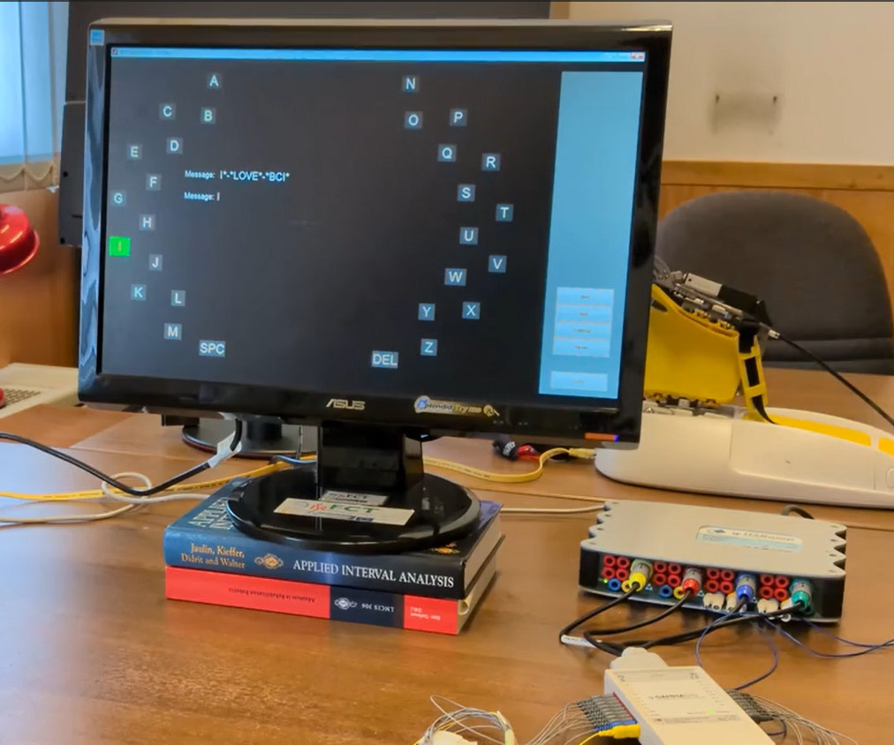

# BCI-Self-paced Multi-session Dataset 

This dataset was created to test the combination of self-paced control with “One-Time Calibration” (user specific, but session-independent models):
- The multi-session dataset is available in the dataset directory
- Read **Instructions_data.pdf** file for explanation regarding LSC communication speller paradigm and how to extract data from datasets
- Run the main file xxxxxx.m  to extract EEG epochs from datasets
- A  demonstratative video of the self-paced communication-speller BCI is available below   

   
  <em>Demo video (MP4, ~90 MB) — click the image to download the video.</em>

# DTA and DBST approaches 
DTA and DBST can be tested  xxx
- Read **Instructions_DTA_DBST.pdf** to check how to to apply DTA and DBST Methods
- - Run xxxx

