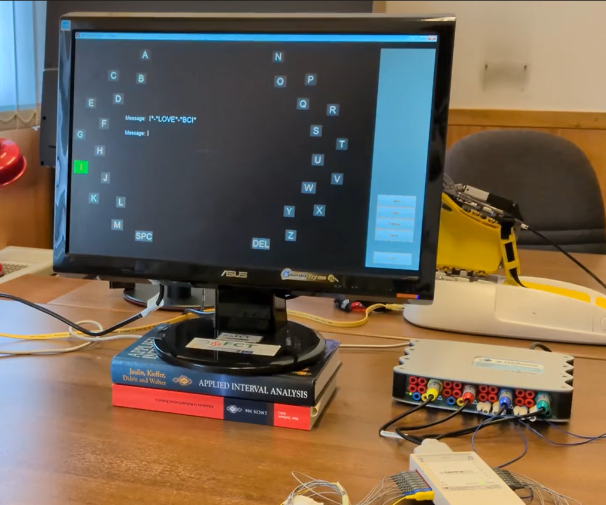

# BCI-Self-paced Multi-session Dataset 

This dataset was created to test the combination of self-paced control with “One-Time Calibration” (user specific, but session-independent models):
- The multi-session dataset is available in the dataset directory
- Read **Instructions_Dataset_epoch_extraction.pdf** file for explanation regarding LSC communication speller paradigm and how to extract data from datasets
- Run the main file **Epoch_extraction.m**  to extract EEG epochs from datasets
- A  demonstratative video of the self-paced communication-speller BCI is available below   

   
  <em>Demo video (MP4, ~90 MB) — click the image to download the video.</em>

# DTA and DBST approaches 
To test DTA and DBST:
- Read **Instructions_DTA_DBST.pdf** to check how to to apply DTA and DBST Methods
- Run **Classification_DTA.m** to use DTA pipline approach
- Run **Classification_DBST.m** to use DTA+DBST pipeline approach

# Cite
Please cite our paper if you find this work is useful to you: 

G. Pires, A. Cruz, J. Figueiredo, U. J. Nunes, "Self-paced ERP-based BCI speller with one-time calibration: A unified framework". TechRxiv. February 25, 2026.

DOI: 10.36227/techrxiv.177203255.59502778/v1

https://www.techrxiv.org/users/1029911/articles/1389674-self-paced-erp-based-bci-speller-with-one-time-calibration-a-unified-framework

